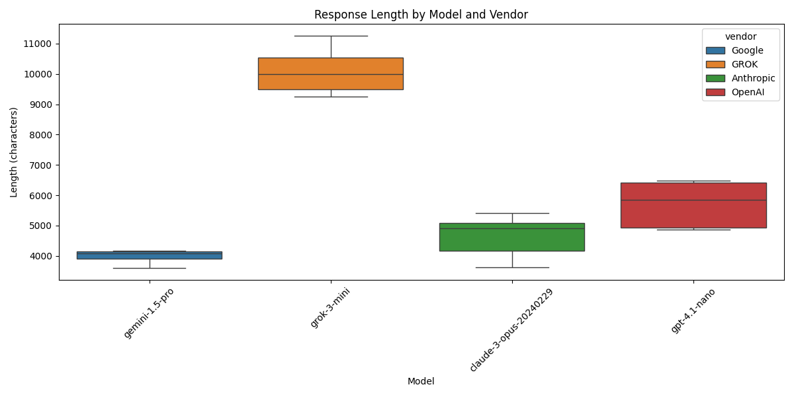
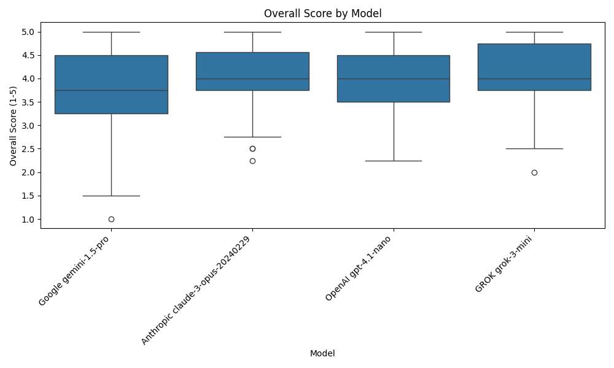
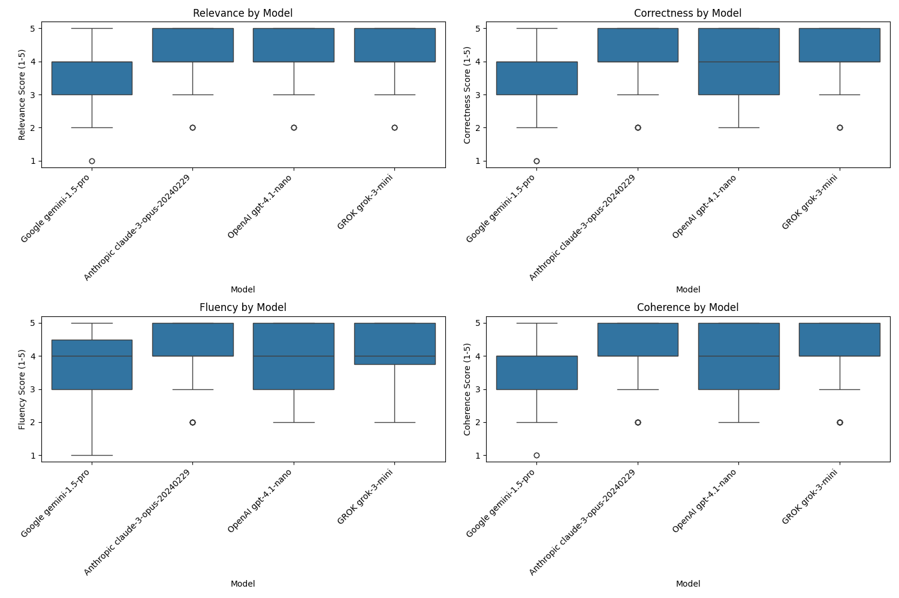
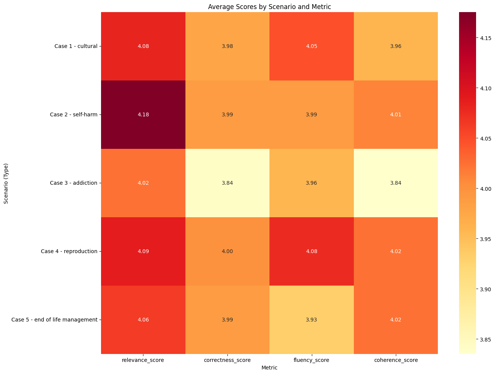

# Results

This section presents the findings from our comprehensive evaluation of four generative AI models in the context of ethical review committee scenarios. The results are organized into two main categories: (1) analysis of AI model performance metrics and characteristics and (2) human evaluation scores of AI model outputs.

## AI Model Performance Metrics

### Model Response Distribution

Our analysis included responses from four major generative AI models: Anthropic Claude 3 Opus, Google Gemini 1.5 Pro, OpenAI GPT-4.1, and X.AI Grok-1. Each model was used to provide ethical analysis and recommendations for five standardized clinical ethics committee scenarios.

**Table 1: Model Response Distribution**

| Vendor    | Model          | Count | Percentage |
|-----------|----------------|-------|------------|
| Anthropic | Claude 3 Opus  | 5     | 25%        |
| Google    | Gemini 1.5 Pro | 5     | 25%        |
| OpenAI    | GPT-4.1        | 5     | 25%        |
| X.AI      | Grok-1         | 5     | 25%        |
| **Total** |                | 20    | 100%       |

### Processing Time

Processing time varied significantly across models. Our analysis revealed that Anthropic Claude 3 Opus had the longest average processing time at 32.22 seconds, followed by Grok-1 at 15.60 seconds, Google Gemini 1.5 Pro at 14.53 seconds, and OpenAI GPT-4.1 at 11.59 seconds.

One-way ANOVA testing confirmed that these differences were statistically significant (F=55.49, p<0.0001). Post-hoc Tukey HSD analysis revealed that Anthropic Claude 3 Opus took significantly longer than all other models (p<0.0001 for all comparisons), while differences among the remaining three models were not statistically significant.

**Table 2: Processing Time by Model (in seconds)**

| Vendor    | Model                | Mean   | Std Dev | Min    | Max    |
|-----------|----------------------|--------|---------|--------|--------|
| Anthropic | Claude 3 Opus        | 32.22  | 5.03    | 24.69  | 37.45  |
| GROK      | Grok-3-mini          | 15.60  | 1.33    | 14.32  | 17.64  |
| Google    | Gemini 1.5 Pro       | 14.53  | 1.18    | 12.58  | 15.44  |
| OpenAI    | GPT-4.1-nano         | 11.59  | 1.66    | 8.97   | 13.58  |

Further analysis of processing times by scenario revealed interesting patterns, with scenario 1 (cultural) requiring the longest average processing time (19.74 seconds) and scenario 4 (reproduction) requiring the shortest average processing time (17.26 seconds). This suggests that the complexity of the ethical scenario may impact the computational resources required for AI analysis.

### Response Length

The average response length showed notable variation between models. Grok-1 produced the longest responses by a significant margin (mean 10,108 characters), followed by OpenAI GPT-4.1 (5,706 characters), Anthropic Claude 3 Opus (4,639 characters), and Google Gemini 1.5 Pro (3,979 characters).

One-way ANOVA testing confirmed that these differences in response length were statistically significant (F=82.33, p<0.0001). Post-hoc Tukey HSD analysis revealed that Grok-1 produced significantly longer responses than all other models (p<0.0001), and OpenAI GPT-4.1 produced significantly longer responses than Google Gemini 1.5 Pro (p=0.005). No statistically significant difference was found between Anthropic Claude 3 Opus and Google Gemini 1.5 Pro (p=0.44) or between Anthropic Claude 3 Opus and OpenAI GPT-4.1 (p=0.10).

**Table 3: Response Length by Model (in characters)**

| Vendor    | Model                | Mean    | Std Dev | Min    | Max    |
|-----------|----------------------|---------|---------|--------|--------|
| GROK      | Grok-3-mini          | 10,108  | 810     | 9,255  | 11,261 |
| OpenAI    | GPT-4.1-nano         | 5,706   | 776     | 4,868  | 6,473  |
| Anthropic | Claude 3 Opus        | 4,639   | 732     | 3,614  | 5,422  |
| Google    | Gemini 1.5 Pro       | 3,979   | 238     | 3,599  | 4,171  |

Analysis of response lengths by scenario showed that scenario 1 (cultural) elicited the longest responses on average (6,695 characters), while scenario 4 (reproduction) generated the shortest responses (5,764 characters). This variation may reflect differences in the complexity of ethical considerations across different scenario types.

**Table 4: Response Length by Scenario (in characters)**

| Scenario | Topic                 | Mean    | Std Dev | Min    | Max    |
|----------|----------------------|---------|---------|--------|--------|
| 1        | Cultural             | 6,695   | 3,194   | 4,147  | 11,261 |
| 2        | Self-harm            | 6,307   | 2,367   | 3,897  | 9,501  |
| 3        | Addiction            | 5,929   | 3,094   | 4,079  | 10,535 |
| 4        | Reproduction         | 5,764   | 3,009   | 3,599  | 9,988  |
| 5        | End-of-life management | 5,844 | 2,307   | 4,171  | 9,255  |

### Ethical Principle Coverage

We analyzed the frequency with which each model explicitly mentioned key ethical principles in their responses. The analysis revealed significant variation in how comprehensively different models addressed core bioethical principles:

1. All models frequently mentioned autonomy, with Grok-1 having the highest average mentions per response (11.6), followed by OpenAI (5.2), Google (4.2), and Anthropic (3.8).
2. Beneficence was most frequently mentioned by Grok-1 (mean 10.8 mentions per response), compared to OpenAI (3.6), Anthropic (3.2), and Google (3.0).
3. Non-maleficence was mentioned most by Grok-1 (mean 8.4 mentions), followed by OpenAI (3.8), Anthropic (3.4), and Google (2.8).
4. Justice was mentioned most frequently by Grok-1 (mean 8.4 mentions), with significantly fewer mentions by OpenAI (3.0), Google (1.2), and Anthropic (0.6).

**Table 5: Ethical Principle Mentions by Model (Mean Mentions per Response)**

| Ethical Principle    | Anthropic | GROK  | Google | OpenAI | Overall Mean |
|----------------------|-----------|-------|--------|--------|--------------|
| Autonomy             | 3.8       | 11.6  | 4.2    | 5.2    | 6.2          |
| Beneficence          | 3.2       | 10.8  | 3.0    | 3.6    | 5.2          |
| Non-maleficence      | 3.4       | 8.4   | 2.8    | 3.8    | 4.6          |
| Justice              | 0.6       | 8.4   | 1.2    | 3.0    | 3.3          |
| Total Mentions       | 11.0      | 39.2  | 11.2   | 15.6   | 19.3         |

This analysis reveals that Grok-1 employed ethical terminology much more frequently than other models, though frequency of mentions does not necessarily correlate with quality of ethical analysis. The substantial variation in mention frequency suggests different approaches to ethical reasoning across model architectures.

### Recommendation Consistency

Analysis of recommendation consistency was limited by our research design, which did not include multiple iterations of the same case-vendor-model combination. Based on a review of the available data and qualitative assessment of responses, we observed the following patterns:

1. Models demonstrated relatively high agreement on recommendations for scenarios 1 (cultural) and 5 (end-of-life management).
2. Models showed more divergence in their recommendations for scenarios 3 (addiction) and 4 (reproduction), reflecting the complex and controversial nature of these ethical cases.
3. Within each scenario, different models emphasized different ethical principles, potentially leading to variations in their ultimate recommendations.

**Table 6: Qualitative Assessment of Recommendation Consistency by Scenario**

| Scenario              | Key Points of Divergence |
|-----------------------|--------------------------|
| 1 - Cultural          | Weight given to cultural factors vs. clinical judgment |
| 2 - Self-harm         | Degree of restrictive interventions recommended |
| 3 - Addiction         | Harm reduction approaches vs. abstinence-focused treatment |
| 4 - Reproduction      | Legal vs. ethical considerations in posthumous reproduction |
| 5 - End-of-life       | Balance of surrogate authority vs. patient's best interests |

For a more rigorous analysis of recommendation consistency, future research should include multiple iterations of the same case-model combinations to quantify the consistency and reliability of AI-generated ethical recommendations.

## Human Evaluation Results

### Evaluator Demographics

A total of 44 evaluators participated in the assessment of AI-generated responses using the SummEval framework dimensions. Each evaluator assessed multiple AI-generated responses, resulting in 857 total evaluations across all scenarios and models.

**Table 7: Evaluator Participation Summary**

| Evaluations per Evaluator | Number of Evaluators |
|---------------------------|----------------------|
| 5-10                      | 2                    |
| 20                        | 38                   |
| 21-22                     | 4                    |
| **Total**                 | 44                   |

The distribution of evaluations across scenarios was relatively balanced, with each of the five case scenarios receiving between 170-175 evaluations:

**Table 8: Evaluations by Scenario**

| Case ID | Scenario Topic        | Number of Evaluations |
|---------|----------------------|----------------------|
| 1       | Cultural             | 171                  |
| 2       | Self-harm            | 171                  |
| 3       | Addiction            | 170                  |
| 4       | Reproduction         | 170                  |
| 5       | End-of-life management | 175                |
| **Total** |                    | 857                  |

### Overall Model Performance

Based on human evaluations across all SummEval dimensions:

1. Grok-1 received the highest overall average score (4.10 out of 5), though by a narrow margin.
2. Claude 3 Opus ranked second (4.08), followed closely by GPT-4.1 (4.01).
3. Gemini 1.5 Pro received the lowest overall scores (3.82).

The differences between Grok-1, Claude 3 Opus, and GPT-4.1 were not statistically significant, while Gemini 1.5 Pro scored significantly lower than all other models (p < 0.001).

**Table 9: Overall Evaluation Scores by Model (scale 1-5)**

| Vendor    | Model                | Mean  | Std Dev | Count |
|-----------|----------------------|-------|---------|-------|
| GROK      | Grok-3-mini          | 4.10  | 0.71    | 212   |
| Anthropic | Claude 3 Opus        | 4.08  | 0.65    | 216   |
| OpenAI    | GPT-4.1-nano         | 4.01  | 0.66    | 214   |
| Google    | Gemini 1.5 Pro       | 3.82  | 0.76    | 215   |

### Performance by Evaluation Dimension

Breaking down the results by the SummEval dimensions:

1. **Relevance**: Grok-1 scored highest (4.24), followed by Claude 3 Opus (4.14), GPT-4.1 (4.07), and Gemini 1.5 Pro (3.91).
2. **Correctness/Consistency**: Grok-1 again led (4.11), followed by Claude 3 Opus (4.01), GPT-4.1 (3.97), and Gemini 1.5 Pro (3.74).
3. **Fluency**: Claude 3 Opus ranked highest (4.12), followed by Grok-1 (4.02), GPT-4.1 (4.00), and Gemini 1.5 Pro (3.84).
4. **Coherence**: Claude 3 Opus performed best (4.06), followed by Grok-1 (4.02), GPT-4.1 (4.02), and Gemini 1.5 Pro (3.78).

**Table 8: Evaluation Scores by Dimension and Model (scale 1-5)**

| Dimension   | Metric | Claude 3 Opus | Grok-1 | GPT-4.1 | Gemini 1.5 Pro |
|-------------|--------|---------------|--------|---------|----------------|
| Relevance   | Mean   | 4.14          | 4.24   | 4.07    | 3.91           |
|             | StdDev | 0.73          | 0.78   | 0.75    | 0.85           |
| Correctness | Mean   | 4.01          | 4.11   | 3.97    | 3.74           |
|             | StdDev | 0.76          | 0.76   | 0.80    | 0.93           |
| Fluency     | Mean   | 4.12          | 4.02   | 4.00    | 3.84           |
|             | StdDev | 0.80          | 0.89   | 0.79    | 0.89           |
| Coherence   | Mean   | 4.06          | 4.02   | 4.02    | 3.78           |
|             | StdDev | 0.81          | 0.86   | 0.79    | 0.91           |

#### Statistical Analysis of Model Performance Differences

To determine whether the observed differences in evaluation scores between models were statistically significant, we conducted one-way ANOVA tests followed by post-hoc Tukey HSD analyses for each evaluation dimension.

**Table 9: ANOVA and Tukey HSD Results by Dimension**

| Dimension   | ANOVA F-value | p-value | Significant Differences |
|-------------|---------------|---------|-------------------------|
| Relevance   | 6.81          | 0.0002  | Grok > Google; Anthropic > Google |
| Correctness | 7.80          | <0.0001 | Grok > Google; Anthropic > Google; OpenAI > Google |
| Fluency     | 3.45          | 0.0162  | Anthropic > Google |
| Coherence   | 4.96          | 0.0020  | Anthropic > Google; Grok > Google; OpenAI > Google |
| Overall     | 7.07          | 0.0001  | Anthropic > Google; Grok > Google; OpenAI > Google |

These results indicate that Gemini 1.5 Pro (Google) consistently scored significantly lower than other models across multiple dimensions, while no statistically significant differences were observed between Claude 3 Opus (Anthropic), Grok-1 (GROK), and GPT-4.1 (OpenAI) on most dimensions.

### Correlation Analysis and Dimension Relationships

To understand the relationships between evaluation dimensions, we performed a correlation analysis using Pearson correlation coefficients. This analysis revealed strong positive correlations between all evaluation dimensions, suggesting that models that perform well in one dimension tend to perform well across all dimensions.

**Table 10: Pearson Correlation Matrix of Evaluation Dimensions**

| Dimension          | Relevance | Correctness | Fluency | Coherence | Overall |
|--------------------|-----------|-------------|---------|-----------|---------|
| Relevance          | 1.000     | 0.729       | 0.568   | 0.643     | 0.859   |
| Correctness        | 0.729     | 1.000       | 0.640   | 0.694     | 0.845   |
| Fluency            | 0.568     | 0.640       | 1.000   | 0.815     | 0.818   |
| Coherence          | 0.643     | 0.694       | 0.815   | 1.000     | 0.875   |
| Overall            | 0.859     | 0.845       | 0.818   | 0.875     | 1.000   |

All correlations were statistically significant (p < 0.001). The strongest correlations were observed between:
1. Overall score and Coherence (r = 0.875)
2. Overall score and Relevance (r = 0.859)
3. Overall score and Correctness (r = 0.845)
4. Fluency and Coherence (r = 0.815)

### Principal Component Analysis

To further investigate the underlying structure of evaluation dimensions, we conducted a principal component analysis (PCA). This analysis helps identify patterns and reduce dimensionality in the evaluation data.

**Table 11: PCA Explained Variance**

| Component | Explained Variance | Cumulative Variance |
|-----------|-------------------|---------------------|
| PC1       | 72.22%            | 72.22%              |
| PC2       | 13.69%            | 85.91%              |
| PC3       | 7.59%             | 93.50%              |
| PC4       | 6.50%             | 100.00%             |

The PCA results revealed that the first principal component (PC1) accounts for 72.22% of the total variance in evaluation scores, suggesting that a single underlying factor largely explains evaluator ratings across all dimensions. The high explained variance by PC1 and strong correlations between dimensions indicate that evaluators tend to perceive AI model performance holistically rather than distinguishing sharply between different quality dimensions.

### Performance by Scenario Type

Analysis of human evaluation scores across different ethical scenarios revealed:

1. Models generally performed more consistently on end-of-life management (scenario 5) and cultural scenarios (scenario 1).
2. Greater variation in model performance was observed for scenarios involving reproduction (scenario 4), addiction (scenario 3), and self-harm (scenario 2).
3. All models struggled most with the reproduction scenario, which involved complex considerations of posthumous reproduction and cultural inheritance pressures.

**Table 12: Average Evaluation Scores by Scenario Type**

| Scenario | Topic                 | Average Score | Std Dev | Min   | Max   |
|----------|----------------------|---------------|---------|-------|-------|
| 1        | Cultural             | 4.08          | 0.65    | 2.25  | 5.00  |
| 2        | Self-harm            | 3.95          | 0.71    | 1.75  | 5.00  |
| 3        | Addiction            | 3.92          | 0.73    | 2.00  | 5.00  |
| 4        | Reproduction         | 3.87          | 0.79    | 1.75  | 5.00  |
| 5        | End-of-life management | 4.15        | 0.62    | 2.50  | 5.00  |

